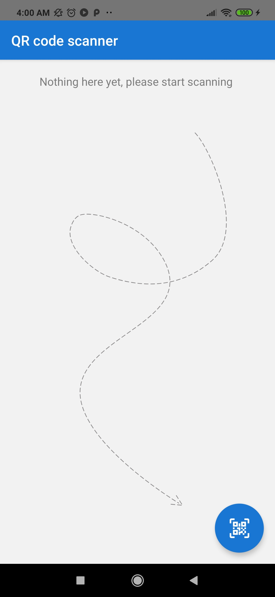
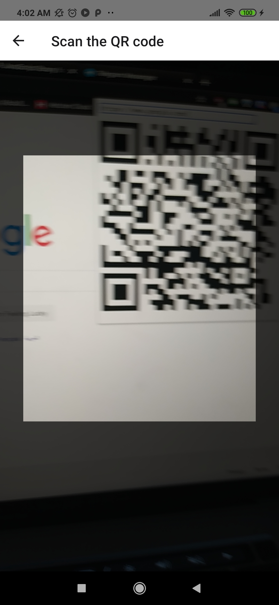
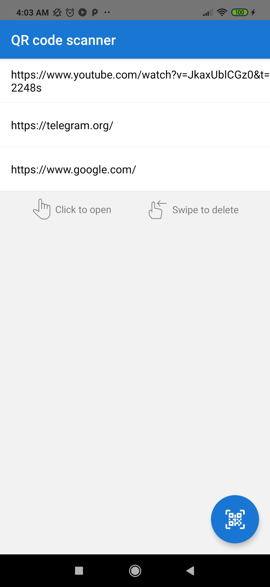
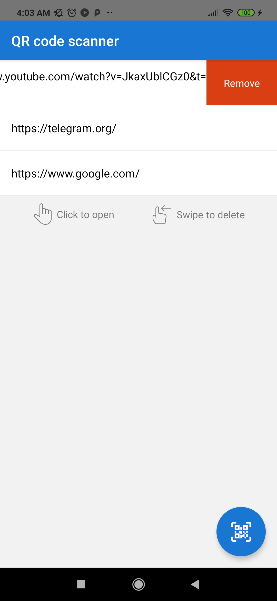
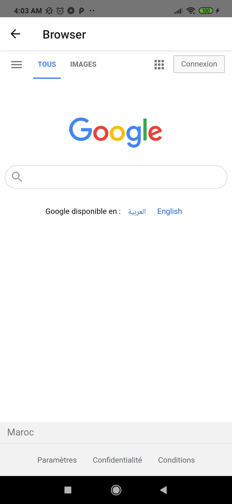

# QR code scanner

## Summary

A React Native application for using the device's camera to scan QR codes and store the collected links.

## Screenshots

## Important commands

In the project directory, you can run:

### `yarn`

Install project packages

### `yarn start`

Runs the metro server for development mode. 

### `yarn android`

Runs the app on attached android

### `yarn ios`

Runs the app on attached iOS device
